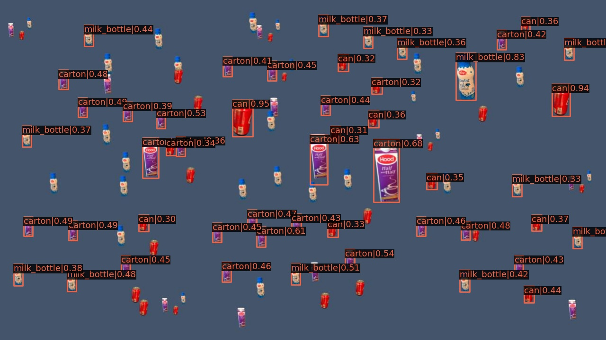
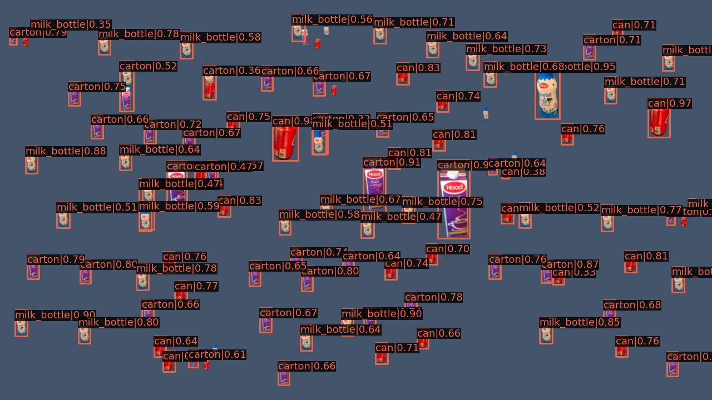
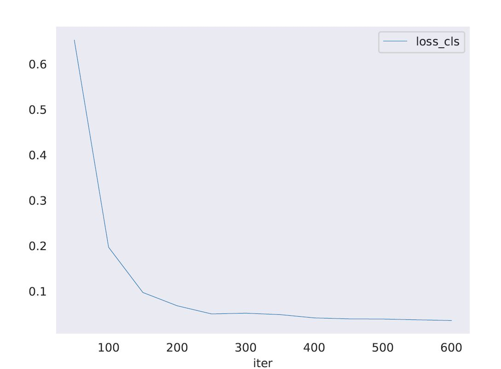
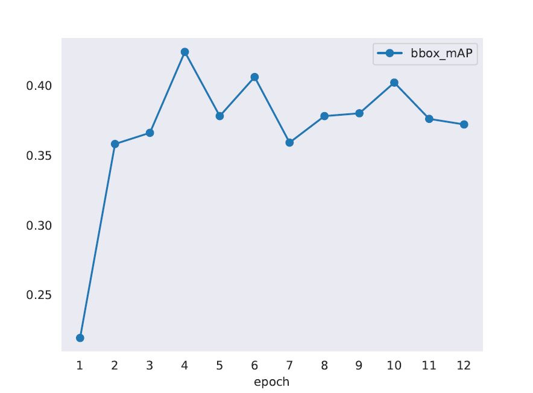

# Farm-ai-ml-exam
<!-- markdown-toc start - Don't edit this section. Run M-x markdown-toc-refresh-toc -->
**Table of Contents**

- [Farm-ai-ml-exam](#farm-ai-ml-exam)
    - [Installation](#installation)
    - [Dataset Preparation](#dataset-preparation)
    - [Configuring the framework](#configuring-the-framework)
    - [Resullts](#resullts)
        - [Without data augmentation](#without-data-augmentation)
        - [With data augmentation](#with-data-augmentation)
        - [Learning curves](#learning-curves)

<!-- markdown-toc end -->

1. I used MMDetection (https://github.com/open-mmlab/mmdetection) for performing object detection.
2. MMDetection is an open source object detection toolbox based on PyTorch.

## Installation
Here are the commands I used to install the library.
```bash
conda create -n openmmlab python=3.7 -y
conda activate openmmlab
conda install pytorch torchvision -c pytorch
pip install openmim
mim install mmdet
```

## Dataset Preparation
1. The dataset has to be reorganised into COCO format to run MMDetection
  - I first converted them to csv format and divided 80, 20 split for training and validation
  - Then I converetd them to coco format.
  - The coco format is as below
    ```
    {
      "images": [image],
      "annotations": [annotation],
      "categories": [category]
        }
      image = {
          "id": int,
          "width": int,
          "height": int,
          "file_name": str,
      }

      annotation = {
          "id": int,
          "image_id": int,
          "category_id": int,
          "segmentation": RLE or [polygon],
          "area": float,
          "bbox": [x,y,width,height],
          "iscrowd": 0 or 1,
      }

      categories = [{
          "id": int,
          "name": str,
          "supercategory": str,
      }]
    ```

## Configuring the framework
The next step is to prepare config file so that data can be loaded successfully.
   ```
    # The new config inherits a base config to highlight the necessary modification
    _base_ = '/mmdetection/configs/faster_rcnn/faster_rcnn_r101_fpn_1x_coco.py'

    # We also need to change the num_classes in head to match the dataset's annotation
    model = dict(
        roi_head=dict(
            bbox_head=dict(num_classes=4)))

    # Modify dataset related settings
    dataset_type = 'COCODataset'
    classes = ('can', 'carton','milk_bottle', 'water_bottle',)
    data = dict(
        train=dict(
            img_prefix='/mnt/ubuntu/home/sravani/Softwares/farm-ai/images-20220204T203638Z-001/images/',
            classes=classes,
            ann_file='/mnt/ubuntu/home/sravani/Softwares/farm-ai/traincoco.json',
            pipeline = train_pipeline),
        val=dict(
            img_prefix='/mnt/ubuntu/home/sravani/Softwares/farm-ai/images-20220204T203638Z-001/images/',
            classes=classes,
            ann_file='/mnt/ubuntu/home/sravani/Softwares/farm-ai/validcoco.json'),
        test=dict(
            img_prefix='/nt/ubuntu/home/sravani/Softwares/farm-ai/images-20220204T203638Z-001/images/',
            classes=classes,
            ann_file='/mnt/ubuntu/home/sravani/Softwares/farm-ai/validcoco.json'))


    runner = dict(max_epochs=12)
    # We can use the pre-trained Faster RCNN model to obtain higher performance
    load_from = '/mnt/ubuntu/home/sravani/Softwares/open-mmlab/mmdetection/checkpoints/faster_rcnn_r101_fpn_1x_coco_20200130-f513f705.pth'

    # change working directory to save logs
    work_dir = '/mnt/ubuntu/home/sravani/Softwares/farm-ai/work_dir2/'

```
## Results
### Without data augmentation


### With data augmentation
Then I added scaling to detect objects of different sizes. The results are displayed below.
```
# The new config inherits a base config to highlight the necessary modification
_base_ = '/home/vj/Software/mmdetection/configs/faster_rcnn/faster_rcnn_r101_fpn_1x_coco.py'

# We also need to change the num_classes in head to match the dataset's annotation
model = dict(
    roi_head=dict(
        bbox_head=dict(num_classes=4)))


train_pipeline = [
    dict(type='LoadImageFromFile'),
    dict(type='LoadAnnotations', with_bbox=True),
    dict(type='RandomFlip', flip_ratio=0.5, direction='horizontal'),
    dict(
        type='Resize',
        img_scale=(666, 499),
        multiscale_mode='value',
        ratio_range=(0.4, 1.2),
        keep_ratio=True
    ),
    dict(
        type='Normalize',
        mean=[123.675, 116.28, 103.53],
        std=[58.395, 57.12, 57.375],
        to_rgb=True),
    dict(type='Pad', size_divisor=32),
    dict(type='DefaultFormatBundle'),
    dict(type='Collect', keys=['img', 'gt_bboxes', 'gt_labels'])
]


# Modify dataset related settings
dataset_type = 'COCODataset'
classes = ('can', 'carton','milk_bottle', 'water_bottle',)
data = dict(
    train=dict(
        img_prefix='/mnt/ubuntu/home/sravani/Softwares/farm-ai/images-20220204T203638Z-001/images/',
        classes=classes,
        ann_file='/mnt/ubuntu/home/sravani/Softwares/farm-ai/traincoco.json',
        pipeline = train_pipeline),
    val=dict(
        img_prefix='/mnt/ubuntu/home/sravani/Softwares/farm-ai/images-20220204T203638Z-001/images/',
        classes=classes,
        ann_file='/mnt/ubuntu/home/sravani/Softwares/farm-ai/validcoco.json'),
    test=dict(
        img_prefix='/nt/ubuntu/home/sravani/Softwares/farm-ai/images-20220204T203638Z-001/images/',
        classes=classes,
        ann_file='/mnt/ubuntu/home/sravani/Softwares/farm-ai/validcoco.json'))


optimizer = dict(type='SGD', lr=0.01, momentum=0.9, weight_decay=0.0001)
optimizer_config = dict(grad_clip=None)
#learning policy
lr_config = dict(
    policy='step',
    warmup='linear',
    warmup_iters=500,
    warmup_ratio=0.001,
    step=[7])
# the max_epochs and step in lr_config need specifically tuned for the customized dataset
runner = dict(max_epochs=12)
#log_config = dict(interval=1)
#log_level = 'INFO'


# We can use the pre-trained Mask RCNN model to obtain higher performance
load_from = '/mnt/ubuntu/home/sravani/Softwares/open-mmlab/mmdetection/checkpoints/faster_rcnn_r101_fpn_1x_coco_20200130-f513f705.pth'

work_dir = '/mnt/ubuntu/home/sravani/Softwares/farm-ai/work_dir2/'


```

Rescaling training set helped with better results


### Learning curves
#### Classification loss

As we can see the loss function decreases over iterations. It gets stabilized after 300 iterations.


The mean Average Precision keeps increasing w.r.t epochs. Even tho we achieved the highest precision
at 3 epochs it is not stable. So we took the last model trained at the last eopoch as the best model.
